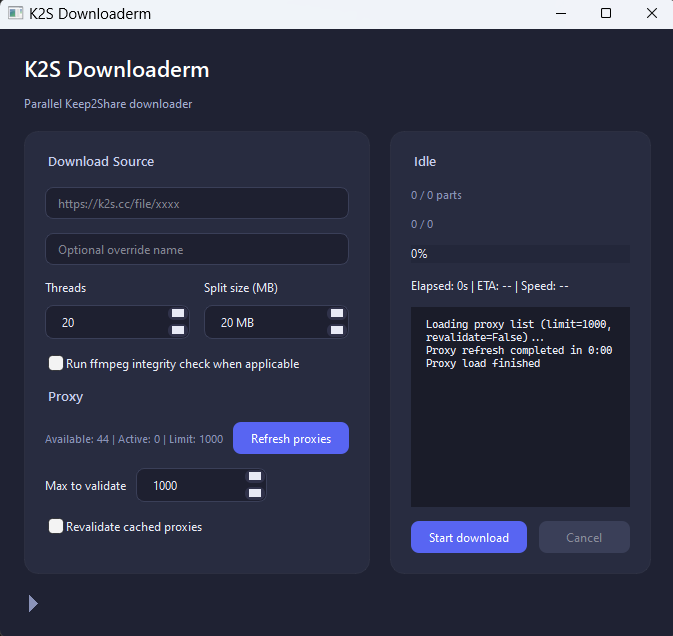

# K2S Downloader

Python tools for downloading Keep2Share files with parallel range requests. The project now offers both a command line workflow and a PySide6 desktop UI.



## Environment
- Tested on Python 3.13.5 on Windows

## Prerequisites
1. Install uv (https://github.com/astral-sh/uv)
2. Ensure ffmpeg is available in your PATH if you want automatic media validation

## Setup
```
uv sync
```
This creates an isolated environment and installs the dependencies declared in pyproject.toml.

## Command Line Usage
```
uv run k2s-downloader <k2s_url> [--filename NAME] [--threads N] [--split-size SIZE] [--no-ffmpeg-check]
```
Example:
```
uv run k2s-downloader https://k2s.cc/file/abc123 --threads 20 --split-size 20M
```

## GUI Usage
```
uv run -- python -m k2s_downloader.gui.app
```
Provide the K2S link inside the application, optionally override the output filename, adjust the thread count and split size, then start the download. Captcha prompts appear inline.

## Legacy Entry Points
For compatibility, running python main.py ... still forwards to the CLI entry point.
